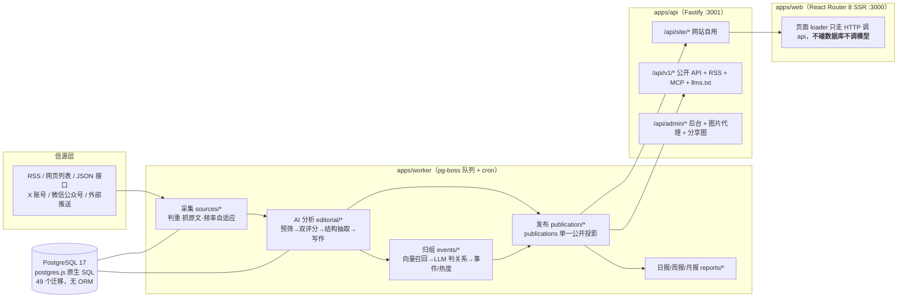
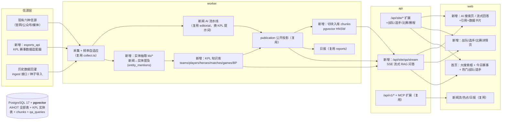

# KPL Intelligence —— 王者荣耀职业联赛智能信息检索平台 · 完整技术方案

> 阶段：Phase 1（AIHOT 深度分析）+ Phase 2（KPL 数据库 / 知识图谱 / 搜索架构设计）
> 性质：技术方案文档，不含实现代码
> 基础仓库：[AIHOT](https://github.com/KKKKhazix/AIHOT)（已克隆至 `./AIHOT`）
> 日期：2026-10-03

---

## 0. 执行摘要

**结论：AIHOT 可以承载 KPL Intelligence，且改动集中在"数据层"而不是"架构层"。**

AIHOT 是一套"信源采集 → AI 精选 → 事件聚簇 → 多出口发布"的新闻站框架，其工程基座（三进程架构、付费请求治理、任务队列、公开读取层、行业包抽象、全套前端壳）全部直接复用。KPL Intelligence 与它的差异集中在三点：

1. **强结构化实体数据**（战队/选手/英雄/比赛/BP）——AIHOT 没有实体表，需要新建 KPL 知识库层；
2. **交互式 AI 问答（RAG）**——AIHOT 的铁律是"页面不调模型"，需要新增一条明示例外的问答链路，但复用其付费治理、护栏、提示词机制；
3. **语义检索**——AIHOT 的搜索是 trigram LIKE（无向量、无分词器），向量只用于 14 天窗口内的事件召回，需要引入 pgvector 做全库混合检索。

工作量估算：约 **75% 复用 / 15% 改造 / 10% 新建**。原方案的第一风险"KPL 结构化数据获取"在开源生态调研后已基本解除：**KPL 官网同源 API（经 KPLDataCrawler 验证）无鉴权可用，覆盖 2019–2026 全部赛季的赛程/赛果/完整 BP/选手局内数据**，辅以 B 站电竞 API、Liquipedia 和 130 英雄中文档案种子。详见 §13 开源数据源评估。

---

## 1. AIHOT 深度分析结论（Phase 1 产出）

### 1.1 架构图（现状）



**三进程职责**：`api`（网站接口/公开 API/RSS/MCP/后台/图片代理/分享图）、`worker`（全部采集与模型调用）、`web`（SSR 只读 api）。部署为单 Docker 镜像 6 服务：db / setup / api / worker / web / caddy。

### 1.2 关键机制盘点（决定我们能"白拿"什么）

| 机制 | 位置 | 对 KPL 的价值 |
|---|---|---|
| **行业包 `industry/`** | site/taxonomy/topics/prompts/selection/sources/features | 换领域的主战场；实测约 85–90% 的领域差异收敛在此文件夹 |
| **付费请求回执 + 预算熔断** | `providers/receipts.ts`（251 行，零业务耦合） | 问答系统的成本护栏直接照搬：逻辑请求幂等去重、失败不重复扣钱、每分钟/时/日熔断 |
| **信源采集骨架** | `sources/`（六种 reader + `collect.ts` 调度） | KPL 信源（官网/公众号/微博）全部落在现有 kind 上，频率自适应直接可用 |
| **素材-修订-发现模型** | `articles` + `article_revisions` + `article_discoveries`（`identity_key UNIQUE` 判重） | 行业无关，原样保留 |
| **公开读取层** | `publication/` → `publications` 表（所有出口唯一读这里） | 原样保留；KPL 实体页新增读取函数即可 |
| **pg-boss 类型化队列** | `jobs/queue.ts`（JobData 联合类型双向校验） | 新增 KPL job 类型照此模式 |
| **提示词机制** | `editorial/prompts.ts`：`{{变量}}`+`{{> include}}`，版本=内容 hash | KPL 问答话术全部放进 `industry/prompts/`，可追溯 |
| **确定性接地护栏** | `writing.ts` 的 `enforceIdentity`/`grounded()`（reports） | RAG 防幻觉现成方案，换 KPL 词库即可 |
| **搜索** | `pool_search` 窄表 + pg_trgm GIN + 手写相关度 SQL + 容量熔断 + `plan_cache_mode=force_custom_plan` | 作为混合检索的"关键词通道"；中文 1–2 字短词靠小表扫描兜底 |
| **向量（现状）** | `embeddings.vector real[]`，**无 pgvector**，Node 内逐条 cosine，仅 14 天窗口 | **不够用**：问答需要全库 top-k，必须引入 pgvector（见 §5 决策 D2） |
| **热度算法** | `events/hot.ts`：48h 窗口 × 独立参与者去重 × 24h 半衰期 | 赛事热议榜公式原样可用 |
| **前端壳** | React Router 8 SSR + Tailwind 4 语义 token + `data-theme` 深色模式 + 40+ 自研组件 | 深色电竞主题只改 CSS 变量值；页面骨架全复用 |

### 1.3 行业抽象的边界（泄漏点清单）

"改行业只改 `industry/`"约 85–90% 成立，以下例外在 Phase 3 处理：

- `packages/backend/src/leaderboard/`（AI 模型榜，约 30 文件）与 `monitor/`（Codex 重置监控）：用 `industry/features.ts` 双开关关闭，代码保留不删（上游合并友好）；
- `apps/api/src/routes/og.ts` 的 `PAGES` 分享图文案表：删两张 AI 卡；
- `packages/contracts/http-policy.ts` 的 REDIRECTS 残留、`taxonomy.ts` 的 `LEADERBOARD_PUBLIC_BOARDS`：按 `docs/customize.md` §6 清理或保留（无害）；
- 日报发布时间 08:00 硬编码在 `reports/compose.ts`（KPL 可接受，暂不改）；
- `CHANNEL_KEYS` 含 `x` 频道（不配 SocialData key 不会注册，无害）。

**重要推论**：`industry/` 只承载"数据与文案"，不承载"新代码模块"。KPL 战队榜/AI 问答等新模块必须仿照 `leaderboard/` 的既有模式在 `packages/backend/src/` 里新建——这是框架设计者的既定扩展路径。

---

## 2. 产品定位与差距分析

| 维度 | AIHOT（现状） | KPL Intelligence（目标） | 差距处理 |
|---|---|---|---|
| 定位 | AI 行业热点日报站 | KPL 专业分析助手（Perplexity / Knowledge Graph 式问答） | 新增问答链路 |
| 核心交互 | 浏览精选流 | 自然语言提问 → 检索 → AI 总结 + 引用 | 新建 QA 模块 |
| 数据形态 | 非结构化新闻 + 自由文本事实 | 结构化赛事数据（比分/BP/英雄）+ 新闻 | 新建实体层 |
| 搜索 | trigram 关键词 | 关键词 + 语义 + 结构化混合检索 | 扩展检索层 |
| 详情页 | 文章/事件/主题 | 战队/选手/比赛（Wikipedia + ESPN 式） | 新增 3 类页面 |
| 时效模式 | T+1 精选日报 | 赛后小时级 + 实时赛程 | 调整采集节奏 |
| 品牌视觉 | 纸感浅色为主 + 可选深色 | 深色电竞主题默认 | 改 CSS token |

---

## 3. 总体架构设计（改造后）

**原则：不推翻 AIHOT 的任何一条架构铁律，新增子系统全部按既有模式挂接。**



### 新增/改造模块一览

| 模块 | 位置（新建） | 职责 | 复用底座 |
|---|---|---|---|
| KPL 知识库 | `packages/backend/src/kb/` | 实体表读写、别名解析、提及关联、荣誉/履历 | `db.ts`、lb_aliases 模式 |
| 实体抽取 | `packages/backend/src/kb/mentions.ts` | 分析流水线后挂一步：把新闻/事实关联到战队/选手/英雄 | `editorial/vocabulary.ts` 词表机制 |
| 赛事数据适配 | `packages/backend/src/sources/esports.ts` | 新信源 kind：拉取赛程/赛果/BO/BP/选手数据 | `sources/types.ts` 的 Candidate 接口 |
| 切块与向量 | `packages/backend/src/kb/chunks.ts` | 文章/比赛/实体档案切块 → embedding 入库 | `providers/embeddings.ts`（扩展支持 pgvector） |
| RAG 问答 | `packages/backend/src/qa/` | 意图理解 → 混合检索 → 生成 → 护栏 → 引用 | `receipts/budgets`、`prompts`、`grounded()` |
| QA 接口 | `apps/api/src/routes/qa.ts` | SSE 流式端点 + 缓存命中 | Problem JSON/ETag 约定 |
| KPL 行业包 | `industry/`（重写内容） | 站名/分类/词表/提示词/门槛/主题 | 机制不动 |
| 前端新页面 | `apps/web/app/routes/` | ai/teams/players/matches 等 | 壳与组件全复用 |

---

## 4. 技术选型

**总原则：AIHOT 已选的东西不换。**

| 层 | 选型 | 决策 |
|---|---|---|
| 运行时 | Node.js 24 + TypeScript（后端免构建直跑） | ✅ 保留 |
| Web 框架 | Fastify（api）+ React Router 8 SSR（web） | ✅ 保留 |
| 数据库 | PostgreSQL 17 + postgres.js 原生 SQL（无 ORM） | ✅ 保留 |
| 队列 | pg-boss 12（cron + 重试 + singleton） | ✅ 保留 |
| 样式 | Tailwind CSS 4（CSS-first 语义 token） | ✅ 保留 |
| 部署 | Docker Compose（6 服务）+ 可选 Caddy | ✅ 保留 |
| **向量检索** | **pgvector 0.8（`vector(1024)` + HNSW cosine）** | 🆕 **D2 决策：引入 pgvector，替换"real[] 线性扫描"**。理由：问答需要全库 top-k，AIHOT 的 `cosine32()` 只支持 14 天窗口小池子；pgvector 让向量与结构化数据同库同事务，不引入第二套存储与备份；Docker 侧换 `pgvector/pgvector:pg17` 镜像（或 apt 装 `postgresql-17-pgvector`），改动最小 |
| Embedding | OpenAI 兼容 `/embeddings`（默认阿里 text-embedding-v4，1024 维） | ✅ 保留（`providers/embeddings.ts` 已抽象，仅改入库表结构） |
| LLM | OpenAI 兼容接口（DeepSeek/千问/智谱/GLM 均可） | ✅ 保留；问答各环节按 capability 三级配置 |
| 中文分词 | **不引入**（沿用 pg_trgm 策略） | ✅ 保留：KPL 查询词多为专名（战队名/选手昵称/英雄名），trigram LIKE 精确命中效果好；语义部分交给向量通道，避免 zhparser 运维负担 |
| 图表 | 手写 SVG（Sparkline/HeatChart） | ✅ 保留；经济曲线/数据趋势用同法 |

### 五条关键架构决策（D1–D5）

- **D1 · 全栈保留**：不重写任何现有进程；所有新模块在 `packages/backend/src/` 内按 leaderboard 模式新建。
- **D2 · pgvector 替换线性扫描**：新增 `chunks` 表用 `vector(1024)` + HNSW；`embeddings` 旧表保留给事件归组（两者模型可不同）。
- **D3 · 实体表独立于 topics**：战队/选手/英雄/比赛是真数据库表；`industry/topics.json` 机制保留给非实体主题（战术体系、赛事文化），不承担实体页。战队/选手页读实体表 + `entity_mentions` 关联新闻。
- **D4 · 结构化数据管道与新闻管道并行、共享基建**：赛事数据走独立 reader（`esports_api`），但入库同样走 pg-boss 任务、同一 Postgres、同一回执治理；历史数据用一次性回灌导入（ingest 接口或种子脚本），不做"爬虫爬两年"。
- **D5 · "页面不调模型"规则修订为明示例外**：AI 搜索页是交互功能（同 admin 属性），问答模型调用发生在 api 进程的专用端点上，全链路过 receipts/budgets + 问题级缓存 + 匿名限流；其余页面仍绝不调模型。

---

## 5. 数据模型（完整 Schema 设计）

延续 AIHOT 约定：纯 SQL 迁移文件（`database/migrations/NNNN_*.sql`，从 **0053** 起编号新增），postgres.js tagged template（**天然参数绑定**——所有外部输入一律走 `sql`...${value}``，禁止任何字符串拼接 SQL，与安全约束一致）。命名风格与 `lb_models/lb_aliases` 的"实体-别名-快照"先例对齐。

### 5.1 赛季与实体（0053_kpl_entities.sql）

```sql
-- 赛季
CREATE TABLE seasons (
  id          text PRIMARY KEY,          -- 'kpl-2026-spring'
  name        text NOT NULL,             -- '2026年KPL春季赛'
  year        int NOT NULL,
  split       text CHECK (split IN ('spring','summer','challenger','annual')),
  start_date  date, end_date date,
  format_note text
);

-- 战队
CREATE TABLE teams (
  id            text PRIMARY KEY,        -- slug: 'ag-super-play'
  name          text NOT NULL,           -- 成都AG超玩会
  short_name    text,                    -- AG
  city          text,
  founded_at    date,
  history_names text[],                  -- 历史队名（AG超玩会→成都AG…）
  league        text DEFAULT 'KPL',
  logo_url      text,
  style_notes   text,                    -- 打法风格摘要（AI 生成，人工可改）
  is_active     boolean DEFAULT true,
  created_at    timestamptz NOT NULL DEFAULT now(),
  updated_at    timestamptz NOT NULL DEFAULT now()
);
-- 别名表：照 lb_aliases 模式，支持不同数据源叫法归一（AG/成都AG/超玩会/Ag超玩会）
CREATE TABLE team_aliases (
  team_id text NOT NULL REFERENCES teams(id) ON DELETE CASCADE,
  alias text NOT NULL, normalized text NOT NULL,
  source text,                          -- 'manual' | 数据源 key
  PRIMARY KEY (team_id, alias)
);
CREATE INDEX team_aliases_norm_idx ON team_aliases (normalized);

-- 选手
CREATE TABLE players (
  id         text PRIMARY KEY,
  nickname   text NOT NULL,              -- 猫神
  real_name  text,                       -- 公开才填
  position   text CHECK (position IN ('对抗路','中路','发育路','游走','打野','教练','辅助')),
  current_team_id text REFERENCES teams(id),
  jersey     text,
  debut_at   date,
  is_active  boolean DEFAULT true,
  bio        text,
  portrait_url text,
  created_at timestamptz NOT NULL DEFAULT now()
);
CREATE TABLE player_aliases (
  player_id text NOT NULL REFERENCES players(id) ON DELETE CASCADE,
  alias text NOT NULL, normalized text NOT NULL, source text,
  PRIMARY KEY (player_id, alias)
);
-- 转会履历（选手↔战队 多对多带时间）
CREATE TABLE player_stints (
  id bigserial PRIMARY KEY,
  player_id text NOT NULL REFERENCES players(id) ON DELETE CASCADE,
  team_id   text NOT NULL REFERENCES teams(id) ON DELETE CASCADE,
  joined_at date, left_at date,
  role      text
);

-- 英雄
CREATE TABLE heroes (
  id text PRIMARY KEY,                  -- slug: 'ma-chao'
  name text NOT NULL,
  roles text[],                         -- 定位：战士/法师/射手/刺客/坦克/辅助
  release_date date,
  portrait_url text,
  notes text
);

-- 荣誉
CREATE TABLE team_honors (
  id bigserial PRIMARY KEY,
  team_id text NOT NULL REFERENCES teams(id) ON DELETE CASCADE,
  season_id text REFERENCES seasons(id),
  kind text CHECK (kind IN ('champion','runner_up','third','fmvp','regular_mvp')),
  note text, source_url text, UNIQUE (team_id, season_id, kind)
);
CREATE TABLE player_honors (
  id bigserial PRIMARY KEY,
  player_id text NOT NULL REFERENCES players(id) ON DELETE CASCADE,
  team_id text REFERENCES teams(id),
  season_id text REFERENCES seasons(id),
  kind text CHECK (kind IN ('champion','fmvp','regular_mvp','finals_mvp','all_star')),
  note text, UNIQUE (player_id, season_id, kind)
);
```

### 5.2 比赛域（0054_kpl_matches.sql）

```sql
CREATE TABLE matches (
  id           text PRIMARY KEY,         -- 'kpl-2026s-po-ag-wolf-0312'
  season_id    text NOT NULL REFERENCES seasons(id),
  stage        text,                     -- 常规赛/季后赛/总决赛/挑战者杯
  bo           int CHECK (bo IN (1,3,5,7)),
  team_a_id    text NOT NULL REFERENCES teams(id),
  team_b_id    text NOT NULL REFERENCES teams(id),
  score_a      int DEFAULT 0, score_b int DEFAULT 0,
  winner_id    text REFERENCES teams(id),
  mvp_player_id text REFERENCES players(id),
  status       text CHECK (status IN ('scheduled','live','finished','cancelled')) DEFAULT 'scheduled',
  scheduled_at timestamptz,
  played_at    timestamptz,
  summary      text,                     -- 胜负原因一句话（AI/人工）
  source_url   text,
  raw          jsonb,
  updated_at   timestamptz NOT NULL DEFAULT now()
);
CREATE INDEX matches_schedule_idx ON matches (scheduled_at) WHERE status = 'scheduled';
CREATE INDEX matches_team_idx ON matches (team_a_id, played_at DESC);
CREATE INDEX matches_team_b_idx ON matches (team_b_id, played_at DESC);
CREATE INDEX matches_season_idx ON matches (season_id, played_at DESC);

-- 小局（BO 中的每一局）
CREATE TABLE games (
  id text PRIMARY KEY,
  match_id text NOT NULL REFERENCES matches(id) ON DELETE CASCADE,
  game_no int NOT NULL,
  winner_id text REFERENCES teams(id),
  duration_secs int,
  mvp_player_id text REFERENCES players(id),
  kills_a int, kills_b int,
  gold_a int, gold_b int,
  economy_curve jsonb,                  -- [{t, gold_a, gold_b}]
  key_fights jsonb,                     -- 关键团战 [{t, desc, outcome}]
  UNIQUE (match_id, game_no)
);

-- BP（Ban/Pick）——采用 BP-For-HoK 验证过的 20 步时序模型（ban+pick 合一，保序）
CREATE TABLE bp_actions (
  game_id text NOT NULL REFERENCES games(id) ON DELETE CASCADE,
  step_index int NOT NULL,              -- 1-20：1-4 首轮ban / 5-10 首轮pick / 11-16 次轮ban(红先) / 17-20 末轮pick
  action_type text NOT NULL CHECK (action_type IN ('ban','pick')),
  side text CHECK (side IN ('blue','red')),
  hero_id text NOT NULL REFERENCES heroes(id),
  player_id text REFERENCES players(id),  -- pick 时对应选手（第21步"英雄交换"直接落最终归属，不单独存记录）
  position text,
  PRIMARY KEY (game_id, step_index),
  UNIQUE (game_id, hero_id)             -- 一局内一英雄只会被 ban 或 pick 一次（巅峰对决除外，见下表）
);
-- 巅峰对决（决胜局盲选，无 ban、双方英雄可重复）独立建表，故意不加 hero 唯一约束
CREATE TABLE pinnacle_picks (
  game_id text NOT NULL REFERENCES games(id) ON DELETE CASCADE,
  team_id text NOT NULL REFERENCES teams(id) ON DELETE CASCADE,
  hero_id text NOT NULL REFERENCES heroes(id),
  player_id text REFERENCES players(id),
  position text,
  PRIMARY KEY (game_id, team_id, hero_id)
);
```

> BP 赛制边界（蓝 255s / 红 300s 计时、全局 BP 锁定为队伍粒度且决胜局解除）为派生规则，不落库，由 `industry/prompts` 与页面说明维护；该设计经 BP-For-HoK 项目在 KPL 2025 赛制下验证。

### 5.3 新闻↔实体桥 + 检索层（0055_kpl_kb_search.sql）

```sql
-- 新闻提及实体（分析流水线的 structure 步骤扩展产出）
CREATE TABLE entity_mentions (
  article_id text NOT NULL REFERENCES articles(id) ON DELETE CASCADE,
  entity_type text NOT NULL CHECK (entity_type IN ('team','player','hero')),
  entity_id   text NOT NULL,
  PRIMARY KEY (article_id, entity_type, entity_id)
);
CREATE INDEX entity_mentions_entity_idx ON entity_mentions (entity_type, entity_id);

-- 检索块（RAG 语料）—— D2 决策落地
CREATE EXTENSION IF NOT EXISTS vector;
CREATE TABLE chunks (
  id bigserial PRIMARY KEY,
  source_type text NOT NULL CHECK (source_type IN ('article','match','team','player','hero')),
  ref_id      text NOT NULL,            -- article.id / match.id / entity slug
  ord         int NOT NULL DEFAULT 0,
  title       text,
  content     text NOT NULL,
  token_count int,
  text_hash   text NOT NULL,            -- 内容变更才重算 embedding
  embedding   vector(1024),
  created_at  timestamptz NOT NULL DEFAULT now()
);
CREATE INDEX chunks_hnsw_idx ON chunks USING hnsw (embedding vector_cosine_ops);
CREATE INDEX chunks_ref_idx ON chunks (source_type, ref_id);

-- 问答记录（缓存 + 审计）
CREATE TABLE qa_queries (
  id bigserial PRIMARY KEY,
  question text NOT NULL,
  normalized_key text NOT NULL,         -- 归一化问题（去空白/标点）做缓存键
  intent text, entities jsonb,
  answer_text text, citations jsonb, data_cards jsonb,
  model text, prompt_version text, receipt_ids bigint[],
  status text CHECK (status IN ('ok','empty','failed')) DEFAULT 'ok',
  duration_ms int, client_ip text,
  created_at timestamptz NOT NULL DEFAULT now()
);
CREATE INDEX qa_key_idx ON qa_queries (normalized_key, created_at DESC);

-- 匿名限流（问答页专用）
CREATE TABLE qa_rate (
  day date NOT NULL, ip_hash text NOT NULL,
  count int NOT NULL DEFAULT 0,
  PRIMARY KEY (day, ip_hash)
);
```

**设计要点**：
- 所有检索 SQL（战队战绩聚合、H2H、英雄使用率）一律参数绑定，聚合视图用 SQL `CREATE VIEW` 或函数封装（如 `team_h2h(a_id, b_id)`、`hero_usage(season_id)`），api 层只传参。
- `matches` 不设唯一业务键（跨源可能同场不同 id），由 `esports` 适配器用 `identity_key` 思路在 `raw` 上做判重，人工可在后台合并；`raw` 冗余存官方源 ID（`cc_match_id` 形如 KPL2026S1M1W1D1、`battle_id`），保证与主源幂等对齐。
- `economy_curve` 官方接口暂无分钟级曲线，允许为空；后续可用 B 站 detail JSON 或自建采样补齐，`key_fights` 由 AI 复盘 job 生成。
- `matches_team_*` 索引支撑"狼队和 eStar 历史交手"类 H2H 查询（双向索引）。
- `chunks.text_hash` 与 AIHOT `embeddings.text_hash` 同机制：内容没变不重复付费。

---

## 6. 数据采集系统设计

### 6.1 信源矩阵（KPL 特化，经开源生态调研后修订）

| 类别 | 信源 | 方式 | 频率 | tier | 状态 |
|---|---|---|---|---|---|
| **赛事数据（主源）** | KPL 官网同源 API `prod.comp.smoba.qq.com/leaguesite/*/open`（无鉴权，覆盖 2019–2026 赛程/赛果/BP/选手局内数据/官方视频链接） | **新 kind `esports_api`**，provider `smoba` | 赛时 5 分钟、平时 2 小时 | T1（结构化） | ✅ KPLDataCrawler 实测可用 |
| 赛事数据（副源） | B 站电竞 API `api.bilibili.com/x/esports`（赛程/比分/选手评分/局内 detail JSON，免登录） | `esports_api`，provider `bilibili`（GloryBond zkpl.py 已做归一化） | 赛时 10 分钟 | T1（交叉验证） | ✅ 代码现成，需实测当季 mid |
| 官方一手 | KPL 官网（pvp.qq.com/KPL）、王者荣耀赛事公众号 | `web_list` / `mp_account`（极致了） | 赛期 15–60 分钟 | T1 | ✅ 框架原生支持 |
| 英雄基础表 | `pvp.qq.com/web201605/js/herolist.json`（官方公开静态 JSON，免鉴权） | 一次性 + 版本更新时刷新 | 每周 | T1 | ✅ 免鉴权 |
| 百科语料 | Liquipedia 王者荣耀 Wiki（MediaWiki API，需描述性 UA + gzip，≤2 req/s）：历届赛事档案、战队/选手页 | 新 kind 或离线脚本 → chunks | 每周增量 | T2 | ✅ API 实测可用 |
| 俱乐部 | 各战队官微/官博、公众号 | `mp_account` + 微博（RSS 桥或新增 weibo reader） | 自适应 | T1_5 | 沿用原方案 |
| 媒体 | 电竞媒体、虎扑、B站资讯 | `rss` / `web_list` | 自适应 | T2 | 沿用原方案 |
| 历史数据 | KPL 官方 API 全量回灌（2019–2026）+ BP-For-HoK 130 英雄中文档案 | 一次性导入脚本 | 一次性 | — | ✅ 见 §6.4 |
| 玩家侧增强（可选） | 王者营地接口（英雄梯度榜/赛事榜 segment=5、英雄三维评分） | GloryBond `endecoder.py` 加密链 | 低频（小时级）+ 缓存 | — | ⚠️ 高维护成本，见 §13 |

### 6.2 新信源 kind：`esports_api`

照 `sources/types.ts` 的 `Candidate` 接口新增读取器 `sources/esports.ts`，config 白名单（`config-keys.ts` 增补）：

```jsonc
{
  "id": "esports-kpl-smoba",
  "kind": "esports_api",
  "provider": "smoba|bilibili|custom",   // 适配器标识，可插拔
  "config": { "leagueId": "2026001", "dataMode": "league|battles|battle" },
  "tier": "T1",
  "interval_minutes": 120
}
```

- **主源 provider `smoba`**（KPL 官网同源，三级抓取拓扑）：
  1. `GET /leaguesite/matches/open?league_id={YYYY0001}` → 整季全部 BO（match_id、双方、比分、bo、阶段、官方视频列表）；
  2. `GET /leaguesite/match/battles/open?match_id=...` → 该 BO 的 battle_id 列表；
  3. `GET /leaguesite/battle/open?battle_id=...` → 单局完整数据：`bp_list`（20 条完整 Ban/Pick 时序）、10 选手（KDA/经济/伤害/承伤/参团率/铭文/出装/召唤师技能/MVP 分）、队伍聚合（大小龙/暴君/推塔）、时长。
  - 请求仅需仿浏览器 Headers（UA + `origin: pvp.qq.com`），无 token；适配器自行加 QPS 限速（源站未限流但保持礼貌）。
- `dataMode=league`：赛程/赛果 → upsert `matches`（不进 articles 流水线，走独立 job `kb.sync-match`）；
- `dataMode=battle`：单局详情 → `games/bp_actions/pinnacle_picks`，赛后触发 `kb.recap` job 生成 AI 复盘；
- **副源 provider `bilibili`**：`matchs/list?mid=&match/info?cid=&grade/info?cid=&bo=`，字段归一化逻辑参考 GloryBond `zkpl.py`（当季赛事 mid 需上线时实测确认）；用于交叉验证与 smoba 缺口补漏；
- 适配器接口隔离：每个 provider 一个 adapter 文件，输出统一 `MatchInput/GameInput`；上游接口变化只改 adapter；
- **URL/接口请求安全**：沿用 `lib/url.ts` 的 SSRF 防护（仅 http/https、host 校验、拒绝环回/私有/保留地址、connect 前 DNS 复核）；接口白名单固化在 provider 配置中。

### 6.3 处理拓扑（新增 job 类型）

| Job | 触发 | 职责 |
|---|---|---|
| `kb.sync-match` | esports 抓取后 | 比赛数据 upsert + 赛果变化检测 |
| `kb.recap` | 比赛转 finished | 生成 AI 复盘（`kpl-recap` 提示词）+ 切块入库 |
| `kb.link-mentions` | `content.analyze` 完成后追加 | 从 structure 抽取结果解析实体 → `entity_mentions` |
| `kb.reindex-chunks` | 发布/实体更新后 | 增量切块 + embedding（复用回执） |
| `sources.fetch-esports` | cron | 赛事数据拉取（复用重试/退避模式） |

定时任务新增（`apps/worker/src/schedules.ts`）：赛期中 `hot.rank` 保持 5 分钟；新增 `kb.chunks-sweep`（每 10 分钟兜底未索引块）；赛后 QA 缓存预热（当日比赛相关问题）。

### 6.4 KPL 基础实体种子

战队/选手/英雄的基础档案以**人工确认的种子 JSON**（`industry/kpl-entities/teams.json` 等）+ `scripts/seed-kpl.ts` 导入（照 `scripts/seed.ts` 的 `ON CONFLICT DO NOTHING` 幂等模式），运营期人工在后台修正。种子来源（按许可情况取舍，见 §13）：

- **英雄库**：BP-For-HoK 的 `heroes.yaml`（130 英雄：定位/主位置/强势期/22 类功能标签/一句话特征）+ 130 张英雄头像，按名字对齐官方 `herolist.json` 补 `hero_id`；
- **战队库**：官方 API `team_id/team_name/team_icon` 直接生成（实测含队徽），人工补成立时间/历史队名/城市；
- **选手库**：官方 API 仅有局内 `actual_player_name`（"北京JDG.绝意"格式，含战队前缀），首版从此解析 + 人工确认建立 roster；
- **赛季档案**：官方 API 按 `league_id=YYYY0001/0002` 枚举回灌 2019–2026；
- **历史新闻**：AIHOT 采集从启用之日起累积；更早的赛事背景语料用 Liquipedia 赛季页补齐。

---

## 7. 搜索系统与 AI Agent 设计（RAG）

### 7.1 混合检索（三通道 + 融合）

```
问题 ──┬─ A. 结构化通道：意图→参数化 SQL（战绩/对阵/英雄数据/荣誉）
       ├─ B. 语义通道：chunks.embedding → pgvector HNSW top-k（cosine）
       └─ C. 关键词通道：pool_search trigram LIKE（复用现有容量熔断/force_custom_plan）
              ↓ RRF 倒数排名融合（k=60）→ 可选 LLM rerank（走回执）
```

- 实体归一先行：问题中的战队/选手别名先查 `*_aliases.normalized` 词典（确定性、零模型成本），命中率低再上 LLM 改写；
- 检索范围按 `entity_mentions`/时间过滤，避免全库扫描。

### 7.2 问答流水线（`packages/backend/src/qa/`）

```
用户问题（POST /api/site/qa/stream）
  ↓ ① 缓存检查：normalized_key 24h 内命中且 status='ok' → 直接回放（零模型成本）
  ↓ ② 限流：qa_rate 匿名 IP 日限额 + budgets.llm 熔断检查
  ↓ ③ 意图理解 [kpl-understand 提示词，小模型，temperature 0，JSON]
       输出 {intent: 赛事|选手|战队|对比|数据|战术|资讯, entities[], season_hint, rewrite[]}
  ↓ ④ 检索（§7.1）→ 上下文组装：结构化数据渲染成 Markdown 表格 + chunks 带编号 [n]
  ↓ ⑤ 生成 [kpl-answer 提示词，SSE 流式]：答案先行、强制引用编号 [n]、不确定要明说
  ↓ ⑥ 确定性护栏（不靠模型）：
       - grounded()：答案中的战队/选手名与数字必须出现在检索语料（复用 reports/compose.ts 校验器）
       - IDENTITY_LEXICON 换成 KPL 词库：防把选手/战队张冠李戴
       - 不过护栏 → 降级重答一次 → 仍失败则展示纯检索结果 + 说明
  ↓ ⑦ 数据卡片：按 intent 直接从结构化结果渲染（对阵卡/比分牌/趋势 Sparkline/荣誉墙）
  ↓ ⑧ 落库 qa_queries + 收回执 completeReceipt
```

**流式协议（SSE）**：`event: status`（意图+检索进度）→ `event: delta`（答案增量）→ `event: citations` → `event: cards` → `event: done`。前端 `EventSource`/fetch 流渲染，断线可拿 `qa/:id` 恢复。

**成本治理**（全部复用 AIHOT 基座）：
- 同一问题 24h 内全局只答一次（receipts `logical_key` + qa_queries 双保险）；
- `budgets` 新增 `qa-answer`、`qa-understand` 服务条目，默认每分钟/时/日上限，后台可调；
- 热点问题预生成（赛后自动问"为什么 X 赢了 Y"入缓存）。

### 7.3 AI 能力清单（capability → 模型配置）

| 能力 | 用途 | 复用/新增 |
|---|---|---|
| prefilter / score / understand / summarize / structure / group / digest | 新闻流水线 | ✅ 复用，提示词换 KPL 版 |
| `kpl-understand` | 问答意图理解 | 🆕（capability 机制直接加一项） |
| `kpl-answer` | 问答生成（流式） | 🆕 |
| `kpl-recap` | 比赛 AI 复盘 | 🆕 |
| report | 日报导语 | ✅ 复用 |

### 7.4 数据获取风险与对策（经开源调研后风险大幅下降）

原评估"KPL 无稳定开放 API"已被推翻：KPL 官网同源接口无鉴权可用（KPLDataCrawler 验证，2019–2026），B 站电竞 API 免登录可交叉验证。剩余风险与对策分层：

1. **接口无官方契约**：`prod.comp.smoba.qq.com` 与 B 站接口均为非承诺接口，字段/路径可能随赛季调整 → 适配器做 schema 探测 + fetch_runs 健康告警（复用 AIHOT 机制）+ 双源交叉验证，单源失效时页面标注"数据截至 X 时间"；
2. **种子打底不变**：基础实体（战队/选手/英雄/历史荣誉）仍以人工确认种子为准，接口只做增量，上游漂移不伤底座；
3. **修正流不变**：赛果修正走后台 admin override（复用 AIHOT 机制）；
4. **合规**：新闻摘要+原文链接（`site_fulltext` 默认关）、图片走签名代理；英雄头像等素材使用前核对来源许可；营地系私有接口（如启用）仅低频缓存使用，注意账号风控与腾讯服务条款。

---

## 8. API 设计

### 8.1 网站自用接口 `/api/site/*`（contracts/site.ts 扩展）

| 端点 | 说明 |
|---|---|
| `GET /api/site/home` | 首页聚合：今日赛事 + 热门战队/选手 + 最新资讯 |
| `GET /api/site/schedule?date=&season=&team=` | 赛程/赛果 |
| `GET /api/site/standings?season=` | 积分/排名 |
| `GET /api/site/teams/:slug` | 战队详情聚合（阵容/荣誉/近期比赛/数据趋势/相关新闻） |
| `GET /api/site/players/:slug` | 选手详情聚合（履历/荣誉/英雄池/数据曲线/相关新闻） |
| `GET /api/site/matches/:id` | 比赛详情（BO/小局/BP/MVP/AI 复盘/相关报道） |
| `GET /api/site/heroes/:slug` | 英雄概览（KPL 使用数据） |
| `POST /api/site/qa/stream` | **SSE 流式问答**（D5 例外端点） |
| `GET /api/site/qa/:id` / `GET /api/site/qa/suggest?q=` | 问答回放 / 问题建议 |

### 8.2 公开 API `/api/v1/*`（openapi 模板增补 paths）

`/teams`、`/teams/:slug`、`/players/:slug`、`/matches`（`?season=&team=&window=`）、`/matches/:id`、`/schedule`、`/standings`、`/heroes/:slug`——沿用现有 V1_OPERATIONS 表驱动 + ETag/Cache-Control/Problem JSON/strictQuery 约定。AIHOT 原有 items/hot/dailies 等端点全保留。

### 8.3 MCP 工具（`mcpPrefix: "kpl"`）

`kpl_search`（混合检索摘要版）、`kpl_get_team`、`kpl_get_player`、`kpl_get_match`、`kpl_get_schedule`、`kpl_get_hot`；`/api/v1/agent` 的 Markdown 版同步扩展；`llms.txt` 更新。

### 8.4 RSS

保留全部现有 feed；新增 `/feed/matches.xml`（赛果）。

---

## 9. 页面结构

### 9.1 路由清单（`apps/web/app/routes.ts`）

| 路由 | 文件 | 状态 | 说明 |
|---|---|---|---|
| `/` | `home.tsx` | **改造** | 首屏改为居中大搜索框（Perplexity 式）+ placeholder「询问任何关于 KPL 的问题…」+ 热门问题 chips；下方：今日赛事卡 / 热门战队 / 热门选手 / 最新资讯时间线 |
| `/ask`（`?q=`） | `ask.tsx` | 🆕 | AI 搜索页：问题 → 流式回答 → 引用资料列表 → 相关数据卡片（比赛/对阵/趋势）→ 相关比赛链接；历史问题入口 |
| `/teams` `/teams/:slug` | `teams.tsx` `team.tsx` | 🆕 | 战队列表（KPL 16 队卡片墙）+ 详情：队徽头图、简介、当前阵容、荣誉墙、赛季战绩、最近比赛、数据趋势、相关新闻（复用 DayList） |
| `/players/:slug` | `player.tsx` | 🆕 | 选手详情：职业履历时间线（player_stints）、荣誉、英雄池 chips、赛季数据变化曲线（Sparkline）、相关新闻 |
| `/matches` `/matches/:id` | `matches.tsx` `match.tsx` | 🆕 | 赛程列表（日历+筛选）；比赛详情：比分牌、BO 小局展开、每局 BP（双方禁用/选取时序）、MVP、关键节点时间线、AI 复盘（digest 样式）、相关报道 |
| `/heroes/:slug` | `hero.tsx` | 🆕（v1.1 可延后） | 英雄页：KPL 登场/胜率趋势、常用选手、counter 提示 |
| `/all` `/hot` `/story/:id` `/daily` `/topics/:slug` `/items/:id` `/about` … | — | ✅ 复用 | 新闻流/热点榜/事件页/日报/主题/文章详情原样保留，文案换 KPL |
| `/admin/*` | — | ✅ 复用 | 后台新增：实体管理（战队/选手/比赛修正）、问答记录审计、赛程日历 |

### 9.2 视觉主题（电竞深色）

- `app/app.css` 只改 `@theme` 语义变量值：默认 `data-theme="dark"`（`THEME_BOOT_SCRIPT` 默认值改 dark）；`--bg:#0b0f14` 级深底、`--accent` 换 KPL 品牌金/青、`--hot` 保留红系做赛果强调、rank-1/2/3 榜单色对应冠军体系；
- 深色下阴影归零改描边——AIHOT 已有此体系，电竞风天然契合；
- 组件复用映射：比赛比分牌 ← `hot.tsx` Lead 卡；BP 时序 ← PillTabs + 时间线圆点；数据卡片 ← RailCard + Score；引用列表 ← GroupSources（同题报道组件改造为引用源）。

---

## 10. 开发计划

### Phase 2 —— 设计落地（约 1 周）
1. `industry/` 重写：site.ts（KPL Intelligence 身份）、taxonomy（赛果/转会/版本/赛制/观点/攻略 六类）、prompts 全套 KPL 化、selection 门槛初值、topics.json、features 双关；
2. 迁移 0053–0055（实体/比赛/检索层）+ contracts 扩展（kpl.ts、qa.ts）；
3. 种子数据整理：16 支 KPL 战队 + 主要选手 + 英雄库（人工确认 JSON）；
4. Dockerfile 换 pgvector 基础镜像，验证迁移链。

### Phase 3 —— 实现（约 3 周）
- **3a 数据采集（1 周）**：`esports_api` reader + 1 个落地适配器（以可得性最高的源优先）；历史数据回灌脚本；`kb.sync-match` / `kb.link-mentions` / `kb.reindex-chunks` job；
- **3b 页面（1 周，与 3a 并行）**：teams/players/matches 三类详情页 + 首页改造 + site API；
- **3c AI 问答（1 周）**：chunks + pgvector 索引；三通道混合检索 + RRF；qa/ 模块 + SSE 端点 + 护栏 + 缓存限流；AI 复盘 job。

### Phase 4 —— 优化与部署（约 1–2 周）
- 深色电竞主题 token + OG 分享图品牌化；
- 评测：精选门槛校准（照 `scripts/eval-selection.ts` 流程标注 100–200 条）；问答离线评测集（检索命中率 + grounded 率，照 selectbench 模式）；
- 缓存头/页缓存调优、SEO（sitemap/JSON-LD 扩展 SportEvent）、备份验证；
- 部署上线（compose + Caddy）。

---

## 11. MVP 版本范围

**MVP 内（In）**
1. KPL 行业包新闻流水线（采集/精选/事件/日报全链路，18 个示范源换为 KPL 信源）；
2. 结构化知识库：战队/选手/英雄/赛季/比赛/小局/BP/荣誉 + 种子数据 + 至少 1 个可用赛事数据源 + 历史回灌（近 2–3 个赛季）；
3. AI 问答：单轮、意图分类、三通道混合检索、流式回答 + 引用 + 数据卡片、缓存与限流；
4. 页面：首页（搜索框版）/ AI 搜索 / 战队列表+详情 / 选手详情 / 比赛列表+详情 / 新闻流 / 热点 / 日报；
5. 后台：实体与比赛修正、问答审计（复用 admin 体系）；
6. 对外出口：v1 扩展端点 + RSS 全保留 + MCP 六工具。

**MVP 外（Out → 后续版本）**
- 多轮对话与追问上下文；用户账号/收藏云同步；
- 英雄详情页与 Counter 关系图（v1.1）；实时比分直播跟踪（v1.2）；
- 周报/月报（赛制天然周期强，值得做但非首版）；微博原生 reader（先用 RSS 桥）；
- 每小局经济曲线可视化交互版（MVP 只画静态曲线）。

---

## 12. 风险登记

| # | 风险 | 等级 | 对策 |
|---|---|---|---|
| 1 | KPL 数据接口无官方契约，适配器可能随赛季失效 | **中低**（原"高"，经开源调研降级） | 官方同源 API 实测稳定可用 + B 站双源交叉验证 + 种子数据打底 + 健康告警降级展示（§7.4、§13） |
| 1b | kpldata 等参考项目无 LICENSE，直接复制数据有版权风险 | 中 | 只借鉴 Schema 与校验脚本思路；数据一律从官方 API 自采或人工整理，必要时联系作者授权 |
| 2 | 实体歧义（选手转会/昵称变更/战队改名） | 中 | `*_aliases` + `player_stints` + IDENTITY_LEXICON KPL 词库 + 后台别名管理 |
| 3 | 问答成本失控 | 中 | receipts 去重 + budgets 熔断 + 匿名限流 + 24h 缓存 + 热点预生成 |
| 4 | LLM 幻觉（编造比分/冠军） | 中 | grounded() 数字与专名校验 + 结构化数据直接渲染卡片（不经模型） + 引用强制 |
| 5 | 版权（全文/图片/数据口径） | 中 | AIHOT 摘要+链接默认模式、签名图片代理、数据注明来源 |
| 6 | 上游 AIHOT 更新难合并 | 低 | 新代码全部走"新增文件/新迁移号"，不动既有文件语义；leaderboard/monitor 用开关关而不删 |

---

## 13. 开源数据源生态评估（8 个项目逐一验证）

> 评估方法：全部仓库浅克隆至 `reference-projects/`，逐项目实读代码/数据文件；关键 API 做了实时调用验证。结论按"对本项目的用法"分级：**直接接入 / 作为设计蓝图 / 需适配 / 仅参考 / 无用**。

### 13.1 评估总表

| 项目 | 定位 | 评级 | 关键结论 |
|---|---|---|---|
| [KPLDataCrawler](https://github.com/ericyxchen2003/KPLDataCrawler) | KPL 官网数据爬虫（Python） | **直接接入（主源）** | 官方同源 API 无鉴权，2019–2026 全赛季，含完整 BP/选手局内数据 |
| [GloryBond](https://github.com/Raysance/GloryBond) | QQ 王者荣耀机器人（NoneBot2） | **直接接入（副源）+ 加密链参考** | 内含 B 站电竞 API 归一化封装（免登录）；王者营地加解密全链路实现最完整 |
| [BP-For-HoK](https://github.com/ThatcherJi/BP-For-HoK) | BP 决策辅助 Web 应用 | **设计蓝图 + 英雄种子** | KPL 赛制 BP 规则 SSoT 与数据模型已验证；130 英雄中文档案+头像 |
| [kpldata](https://github.com/ded09f/kpldata)（[在线站](https://ded09f.github.io/kpldata/)） | 粉丝向 KPL 数据站 | **仅 Schema 参考**（无 LICENSE） | 2016–2026 赛季档案 Schema 极佳；数据不可整库复制 |
| [Liquipedia HoK Wiki](https://liquipedia.net/honorofkings/King_Pro_League) | 电竞百科 | **可接入（百科语料）** | MediaWiki API 实测可用（UA+gzip，≤2 req/s），历届赛事/战队/选手页 |
| [wzyd-view](https://github.com/Kloping/wzyd-view) | 王者营地可视化 API（Java） | 仅参考 | 只有玩家个人数据、无赛事数据；请求头模板与 XXTEA 解密可参考 |
| [Real-Time-HoK-Dataset](https://github.com/yangzelong14/Real-Time-HoK-Dataset) | 实时胜率预测数据集 | 仅参考 | 路人局非 KPL；全量 184k 场从未公开；30 秒时序帧 Schema 可借鉴 |
| [hokoff](https://github.com/tencent-ailab/hokoff)（腾讯 AI Lab） | 王者 RL 离线强化学习框架 | 无用 | AI 模拟轨迹，与真实赛事数据无关 |

### 13.2 KPLDataCrawler —— 主数据源（重点）

爬取 `pvp.qq.com/matchdata` 背后的官方同源接口，三个**无鉴权 GET**（实测均 200）：

```
https://prod.comp.smoba.qq.com/leaguesite/matches/open?league_id={YYYY0001}   # 整季全部 BO
https://prod.comp.smoba.qq.com/leaguesite/match/battles/open?match_id=...     # 该 BO 的 battle_id 列表
https://prod.comp.smoba.qq.com/leaguesite/battle/open?battle_id=...           # 单局完整数据
```

- **覆盖**：`league_id=YYYY0001/0002` 可枚举；实测 2019 春（118 场）→ 2026 春全部可用（2017 返回 404）。请求仅需仿浏览器 Headers（UA + `origin: pvp.qq.com`），响应 `text/plain` 包 JSON。
- **battle 层字段**（对本项目 Schema 几乎一一对应）：
  - `bp_list`（20 条）：`{camp, is_ban_or_pick, hero_id, hero_name, position}` 按序即完整 Ban/Pick 时序；
  - `battle_player_list`（10 人）：hero、`actual_player_name`（"北京JDG.绝意"）、`is_mvp/mvp_score`、KDA、经济、伤害/承伤（含占比）、参团率、**30 格铭文、6 件装备、召唤师技能**；
  - 队伍聚合：击杀/推塔/暴君/大小龙/风暴龙王；`game_duration`；
  - `match_battle_video_list`：**每局官方视频回放链接**（腾讯视频）。
- **缺口**：无分钟级经济曲线；无独立选手档案接口（选手信息内嵌于对局，roster 需自行积累）。
- 代码质量好（类型注解/并发/重试/tqdm），真实依赖仅 `requests, tqdm`（README 提到的 requirements.txt 不存在），Python 3.10+。

### 13.3 GloryBond —— B 站副源 + 营地加密链

- **B 站电竞 API（`NBot/hok/zkpl.py` + `zapi.py`，最有价值发现）**：`https://api.bilibili.com/x/esports/matchs/list?mid=…`、`/match/info?cid=…`、`/grade/info?cid=…&bo=…`，仅需 `Referer: https://www.bilibili.com/v/game/match/`，**免登录**；已做字段归一化（赛程/每局 BP/选手评分/资源/回放 aid）。当季 KPL 的 `mid` 需上线时实测。
- **王者营地接口全链路**：`kohcamp.qq.com/game/*`（战绩/英雄榜/三维评分），`tools/endecoder.py` 用纯 Python 实现 RSA→XXTEA→gzip 完整加解密（比 wzyd-view 的 frida 方案更完整）；`NBot/resources/wzry_data_format/` 留有 6 个接口真实响应样例。
- **可平移的工程件**：限流 1 req/s + 低优先级队列 + 3 次重试识别"登录态失效"；KPL 赛果推送的去重+分布式锁+战报渲染流水线。
- **风险**：营地私有接口需真实账号 token，有风控/封禁风险 → 本项目仅作可选增强（英雄梯度榜 segment=5 赛事榜），低频+落盘缓存，**不进关键路径**。

### 13.4 BP-For-HoK —— BP 数据模型蓝图与英雄档案种子

- **KPL 赛制 BP 规则 SSoT**（`docs/bp-rules.md`）：20 步标准时序（1-4 首轮 ban → 5-10 首轮 pick → 11-16 次轮 ban（红先）→ 17-20 末轮 pick）、蓝 255s/红 300s、全局 BP 锁定（队伍粒度、决胜局解除）、巅峰对决盲选独立处理——本项目 §5.2 的 `bp_actions`/`pinnacle_picks` 表设计直接采纳该模型。
- **英雄中文档案**（`data/seed/heroes.yaml`，130 英雄）：positions / primary_pos / power_period / function_tags（22 类枚举）/ version_strength(1-10，人工估算) / notes（≤30 字）+ 130 张头像。缺官方 hero_id，按名字对齐 `herolist.json` 即可入库，作为英雄页与 RAG 语料的初始种子。
- **克制关系**：无静态数据，方法论可借鉴（同局敌对阵营胜率 + 贝叶斯平滑 α=10, prior=0.5, confidence=n/(n+α)）——本项目未来用全量 KPL 对局（KPLDataCrawler 回灌）跑同一统计，样本量不再是 34 局而是数万局。
- **架构思路**："合法性判断 100% 交给规则引擎，LLM 不自己推理"——与本方案 qa 模块的"确定性护栏"哲学一致。

### 13.5 kpldata、Liquipedia 与其余

- **kpldata**：手工整理的赛季 JSON（2026 夏：18 队/124 场/积分榜/赛制规则/冠军/FMVP），Schema 完整（`teams{id,name,shortName,city,seatType,color}`、`matches{id,stage,group,date,bo,status,home,away,score,winner}`）。**无 LICENSE 文件 → 数据默认版权保留，只借鉴 Schema 与 `validate-data.mjs` 校验思路，不复制数据**；Elo/近况/交锋加权胜率预测模型可作为本站"胜率预测"模块（v2）参考。
- **Liquipedia**：MediaWiki API（`api.php?action=parse&prop=wikitext`）实测可用，要求描述性 User-Agent + gzip、≤2 req/s；KPL 2026 春季赛等赛季页齐全。用途：历史赛事档案与战队/选手背景介绍 → 切入 chunks 作 RAG 百科语料。
- **wzyd-view**：营地玩家侧数据代理（Java Spring Boot），无赛事维度；2026/03 起官方加密持续升级，靠 frida 抓密钥维护成本高。仅参考其请求头模板与 Java 版 XXTEA 实现。
- **Real-Time-HoK-Dataset**：100 场**路人排位**样例（非 KPL），全量 184k 场从未公开；其 30 秒时序帧 Schema（双阵营对称、兵线/野区/经济特征）留给未来"实时胜率预测"模块参考。
- **hokoff**：游戏引擎内 AI 模拟对局的 RL 数据集（hdf5 轨迹），与真实赛事情报检索无关，排除。

### 13.6 修订后的数据采集策略

```
主源   KPL 官方同源 API（smoba provider）     → 结构化事实（赛程/赛果/BP/局数据），2019 起全量回灌
副源   B 站电竞 API（bilibili provider）      → 交叉验证 + 补漏（选手评分/回放链接）
百科   Liquipedia + 官方 herolist.json        → 战队/选手/英雄背景语料 → chunks
种子   BP-For-HoK heroes.yaml + 官方 team 数据 → 首版实体档案（人工确认后入库）
新闻   AIHOT 原有六种信源（官网/公众号/媒体）  → 赛事报道、采访、战术分析 → 精选/事件/日报
可选   王者营地接口（GloryBond 加密链）        → 英雄梯度/赛事榜，低频缓存，不进关键路径
```

每层独立健康监控（复用 `fetch_runs`/`ops.alerts`），任何单层失效不影响其余层级；结构化事实以本站种子+主源为准，新闻与百科只做增量与背景。

---

## 附：参考来源

- AIHOT 仓库与文档：`./AIHOT`（README、docs/architecture.md、docs/customize.md、docs/selection.md）
- 开源参考项目（已克隆至 `./reference-projects/`）：[KPLDataCrawler](https://github.com/ericyxchen2003/KPLDataCrawler)、[GloryBond](https://github.com/Raysance/GloryBond)、[BP-For-HoK](https://github.com/ThatcherJi/BP-For-HoK)、[kpldata](https://github.com/ded09f/kpldata)（[在线站](https://ded09f.github.io/kpldata/)）、[wzyd-view](https://github.com/Kloping/wzyd-view)、[Real-Time-HoK-Dataset](https://github.com/yangzelong14/Real-Time-HoK-Dataset)、[hokoff](https://github.com/tencent-ailab/hokoff)、[Liquipedia KPL](https://liquipedia.net/honorofkings/King_Pro_League)（API 条款见 liquipedia.net/api-terms-of-use）
- 早期调研：[如何查到 KPL 的数据库（PingCode）](https://docs.pingcode.com)、[王者营地接口抓包实战（CSDN）](https://blog.csdn.net)
